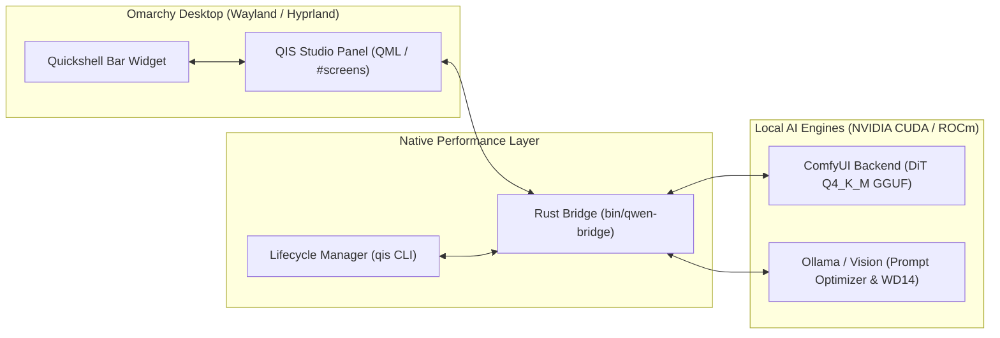

# QIS (Qwen Image Studio)

[](https://github.com/simonezpx3/omarchy-qwenimage/actions/workflows/ci.yml)
[](LICENSE)
[](#)
[](#)
[-orange.svg)](#)
[-success.svg)](#)

Universal native Generative AI Studio for **Omarchy Linux** and **Quickshell** (Wayland / Hyprland).

Designed for high-performance local diffusion inference with zero cloud dependencies and zero token costs.


---

## Architecture Overview

QIS connects the reactive QtQuick/QML interface with native system acceleration and local AI engines:



---

## Interface Tour

| Studio & Canvas | Prompt & Inspiration Explorer | History & Local Archive |
|---|---|---|
|  |  |  |

---

## Features

- **Text-to-Image (DiT Diffusion):** Native high-resolution generation via local ComfyUI backend.
- **Image-to-Image & Auto Aspect Match:** Automatic aspect ratio extraction (`21:9`, `16:9`, `4:3`, `1:1`, `3:4`, `9:16`) preventing image distortion.
- **WD14 Tag Interrogator:** Fast Danbooru tag extraction via ONNX / ViT models.
- **Vision Prompt Engineering:** Reverse-engineering existing scenes into rich diffusion prompts.
- **Civitai Explorer:** Curated prompts, negative prompts, and generation settings browser.
- **Fast Rust Bridge:** High-performance native bridge (`bin/qwen-bridge`) executing telemetry, PNG metadata chunk manipulation, and system monitoring in sub-millisecond speeds.
- **Live System Telemetry:** Header badges showing connected Qwen model, ComfyUI, Ollama, CUDA, Quickshell, and VRAM utilization.
- **In-Button Live Timers:** Dynamic, non-intrusive second counters inside active buttons (`GENERATE`, `UPDATE`, `OPTIMIZE`, `TAGS`).
- **Wallpaper Integration:** One-click wallpaper deployment to Omarchy and Hyprland.

---

## Interactive Controls & Shortcuts

| Action / Gesture | Trigger | Result |
|---|---|---|
| **Toggle Studio Panel** | Click on bar widget or `omarchy-shell simonez.qwenimage toggle` | Opens/closes the floating studio window |
| **Quick Plugin Update** | Left Click on `󰑐 UPDATE` in header | Updates plugin & Rust bridge without restarting the shell (`< 1s`) |
| **Full Stack Update** | Right Click on `󰑐 UPDATE` in header | Opens confirmation banner to update ComfyUI core, custom nodes, and models |
| **Close Studio** | `Esc` or click outside | Smoothly closes the window and frees viewport |
| **Live Telemetry Refresh** | Click on `󰑐 REFRESH` | Forces immediate hardware and VRAM telemetry update |

---

## Hardware Tier Profiling

QIS automatically profiles your hardware on installation and suggests the optimal runtime configuration:

| Tier | VRAM | Recommended Configuration |
|---|---|---|
| **Tier S** | $\ge$ 16 GB | Full FP8 / BF16 direct weights, maximum generation speed. |
| **Tier A** | 8 – 12 GB | GGUF Q4_K_M DiT + Qwen3-VL 8B Text Encoder with asynchronous VRAM offloading (`--async-offload 2`). |
| **Tier B** | 6 GB | GGUF Q3_K_S DiT + Qwen2.5-VL 3B Text Encoder with sequential CPU offload. |
| **Tier C** | $\le$ 4 GB / iGPU | Remote LAN cluster execution via network ComfyUI backend. |

---

## Installation & Setup

```bash
git clone https://github.com/simonezpx3/omarchy-qwenimage.git
cd omarchy-qwenimage
chmod +x install.sh
./install.sh
```

The installer will:
1. Profile GPU vendor (NVIDIA, AMD, Intel) and detect available VRAM.
2. Check for ComfyUI and diffusion models; if missing on new hardware, offer one-click automated stack installation.
3. Deploy the native bridge binary `bin/qwen-bridge`.
4. Deploy the `qis` management CLI into `~/.local/bin/qis`.
5. Validate plugin schema via `omarchy plugin validate`.
6. Register the plugin cleanly into the Omarchy bar layout.
7. Perform safe IPC hot-reload.

---

## Lifecycle & Updater CLI (`qis`)

Once installed, manage the entire ecosystem with the `qis` command:

```bash
qis             # Interactive management menu (Setup, Update, Models, Rollback)
qis status      # Displays dependency health matrix and hardware profile
qis setup       # Automated installation of ComfyUI, custom nodes, and models
qis update      # Check and update QIS plugin, ComfyUI core, and nodes
qis rollback    # Revert ComfyUI to the previous working checkpoint
```

---

## Uninstallation

```bash
cd omarchy-qwenimage
chmod +x uninstall.sh
./uninstall.sh
```

---

## License

[MIT License](LICENSE). Developed by simonez.
