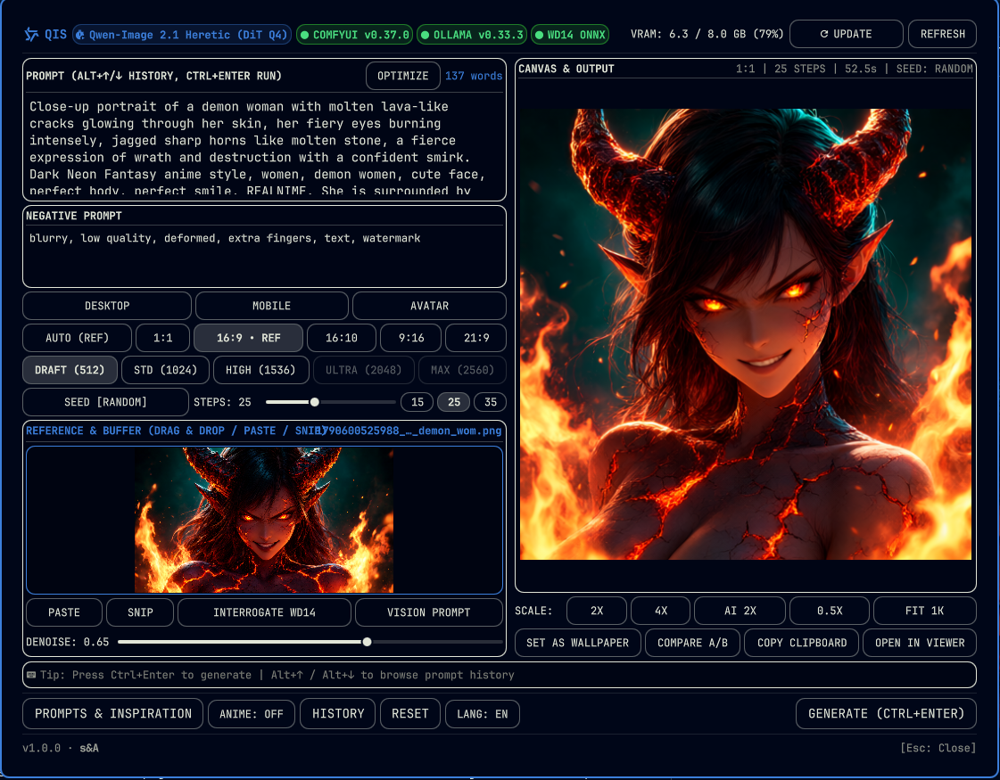
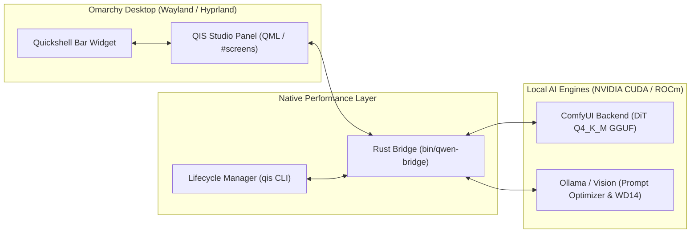
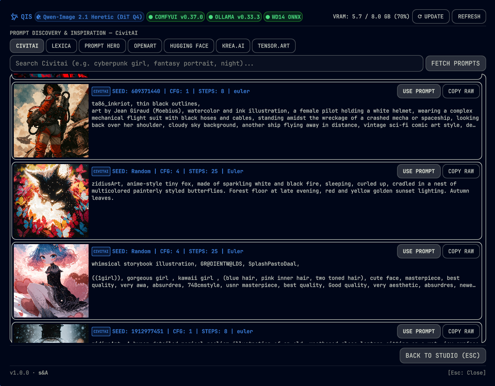
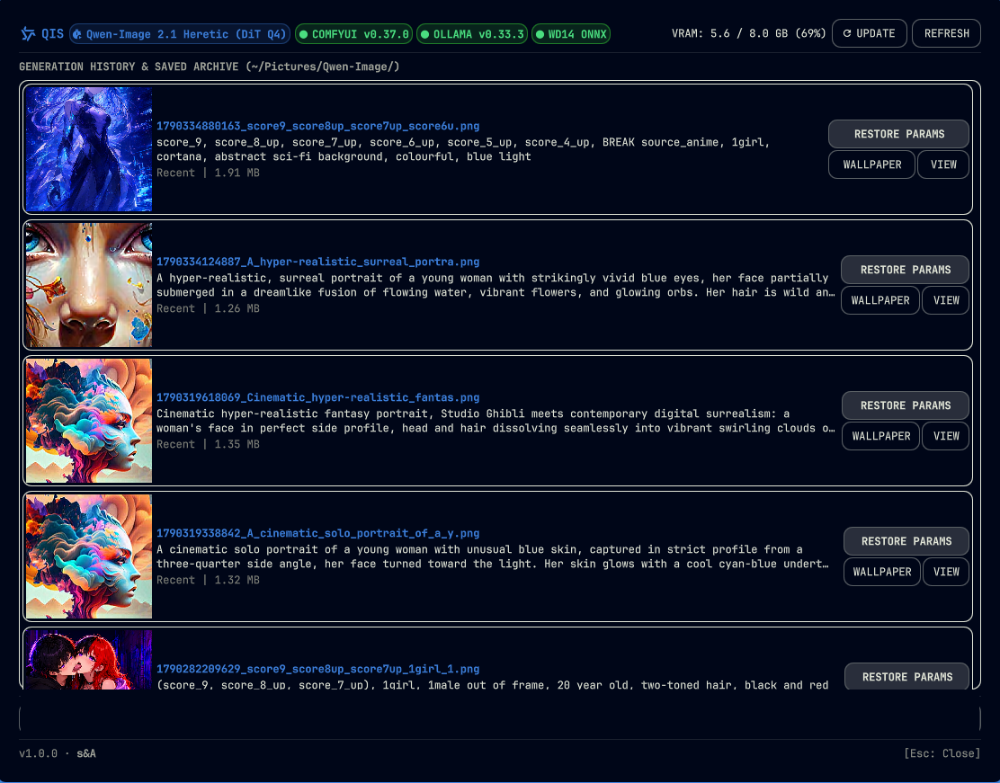

# QIS (Qwen Image Studio)

[](https://github.com/simonezpx3/omarchy-qwenimage/actions/workflows/ci.yml)
[](LICENSE)
[](#)
[](#)
[-orange.svg)](#)
[-success.svg)](#)

Universal native Generative AI Studio for **Omarchy Linux** and **Quickshell** (Wayland / Hyprland).

Designed for high-performance local diffusion inference with zero cloud dependencies and zero token costs.



---

## Architecture Overview

QIS connects the reactive QtQuick/QML interface with native system acceleration and local AI engines:


```mermaid
graph LR
    subgraph UI ["Omarchy Desktop (Wayland / Hyprland)"]
        Bar["Quickshell Bar Widget"]
        Panel["QIS Studio Panel (QML / #screens)"]
    end

    subgraph Core ["Native Performance Layer"]
        Bridge["Rust Bridge (bin/qwen-bridge)"]
        CLI["Lifecycle Manager (qis CLI)"]
    end

    subgraph Backend ["Local AI Engines (NVIDIA CUDA / ROCm)"]
        Comfy["ComfyUI Backend (DiT Q4_K_M GGUF)"]
        Ollama["Ollama / Vision (Prompt Optimizer & WD14)"]
    end

    Bar <--> Panel
    Panel <--> Bridge
    CLI <--> Bridge
    Bridge <--> Comfy
    Bridge <--> Ollama
```

---

## Interface Tour

| Studio & Canvas | Prompt & Inspiration Explorer | History & Local Archive |
|---|---|---|
|  |  |  |

---

## Features

- **Text-to-Image (DiT Diffusion):** Native high-resolution generation via local ComfyUI backend.
- **Turbo Mode (Viggle Turbo DMD):** 6-step distillation yielding ~5s generation on consumer GPUs (8GB+ VRAM) at 0 token cost, seamlessly toggleable from the bottom action bar.
- **Heretic LoRA (Abliterated Uncensored Latent):** Dedicated uncensored diffusion adapter for uninhibited artistic freedom, with dynamic LoRA weight governor preventing tensor saturation.
- **Anatomical Safety Guard:** Intelligent anatomy preservation automatically enforcing a standard resolution floor (1024 px) and adaptive Euler sampling profile when human subjects, portraits, or erotic themes are detected in draft mode.
- **Live TAEQI 2.1 Previews:** Real-time intermediate diffusion preview streaming over WebSocket directly from ComfyUI (0 VRAM overhead, decoded via ultra-fast TAEQI into RAM-disk tmpfs).
- **Quick Step Presets:** Instant step selection (`15`, `25`, `35`) with active state highlight and live elapsed timer.
- **Universal Wayland Clipboard Engine:** Deep Rust integration decoding raw image formats (PNG, JPEG, WebP, BMP, TIFF), file manager URIs (`file://` from Nemo, Thunar, Nautilus), and web image URLs directly into the reference buffer.
- **Image-to-Image & Auto Aspect Match:** Automatic aspect ratio extraction (`21:9`, `16:9`, `4:3`, `1:1`, `3:4`, `9:16`) preventing image distortion.
- **Anime LoRA & Adaptive Resolution Profiling:** Instant anime style injection and VRAM-aware resolution presets (`standard`, `performance`, `high`).
- **WD14 Tag Interrogator:** Fast Danbooru tag extraction via ONNX / ViT models.
- **Vision Prompt Engineering:** Reverse-engineering existing scenes into rich diffusion prompts.
- **Civitai Explorer:** Curated prompts, negative prompts, and generation settings browser with single-click apply and double-click instant generation.
- **Hardened Rust Bridge & Regression Suite:** High-performance native bridge (`bin/qwen-bridge`) equipped with a 4096-character buffer clamp, automated LLM JSON prompt envelope unpacking, toxic foreign tag sanitization (`<lora:...>`, `<embedding:...>`), and an automated unit test suite.
- **Dynamic Output Node Resolution:** Resilient backend listener that dynamically detects SaveImage nodes across custom workflows instead of relying on fixed node indices.
- **Omarchy UI Architecture:** Pixel-perfect geometric harmony with `Style.cornerRadius`, concentric surface depth, cybernetic reticle corners, and zero box-clutter.
- **Tabular Numerals & Optical Stability:** OpenType `tnum` tabular numerals across diffusion step badges, timers, and VRAM telemetry eliminating horizontal layout jitter.
- **Live System Telemetry:** Header badges showing connected Qwen model, ComfyUI, Ollama, CUDA, Quickshell, and VRAM utilization.
- **In-Button Live Timers:** Dynamic, non-intrusive second counters inside active buttons (`GENERATE`, `UPDATE`, `OPTIMIZE`, `TAGS`, `SCALE`).
- **Wallpaper Integration:** One-click wallpaper deployment to Omarchy and Hyprland.

---

## Interactive Controls & Shortcuts

| Action / Gesture | Trigger | Result |
|---|---|---|
| **Toggle Studio Panel** | Click on bar widget or `omarchy-shell simonez.qwenimage toggle` | Opens/closes the floating studio window |
| **Instant Generation** | `Ctrl + Enter` in prompt or negative prompt | Immediately launches diffusion synthesis |
| **Turbo Mode Toggle** | Click on `TURBO: ON // OFF` in bottom bar | Toggles 6-step DMD acceleration (~5s) vs standard 28-step Euler sampling |
| **Heretic LoRA Toggle** | Click on `HERETIC: ON // OFF` in bottom bar | Toggles uncensored latent diffusion adapter |
| **Anime LoRA Toggle** | Click on `ANIME: ON // OFF` in bottom bar | Toggles SD_Tutorial anime and illustration stylization adapter |
| **Paste Reference Image** | Click on reference preview box or `Ctrl + V` | Decodes image, file path, or URL from Wayland clipboard |
| **CivitAI Quick Apply** | Single click on any prompt card | Loads prompt and parameters into Studio |
| **CivitAI Direct Synthesize** | Double click on any prompt card | Loads prompt and triggers immediate generation |
| **Return to Studio** | `Esc` from A/B Compare or History views | Navigates back to main Studio view |
| **Quick Plugin Update** | Left Click on `󰑐 UPDATE` in header | Updates plugin & Rust bridge without restarting the shell (`< 1s`) |
| **Full Stack Update** | Right Click on `󰑐 UPDATE` in header | Opens confirmation banner to update ComfyUI core, custom nodes, and models |
| **Close Studio** | `Esc` or click outside | Smoothly closes the window and frees viewport |
| **Live Telemetry Refresh** | Click on `󰑐 REFRESH` | Forces immediate hardware and VRAM telemetry update |

---

## Hardware Tier Profiling

QIS automatically profiles your hardware on installation and suggests the optimal runtime configuration:

| Tier | VRAM | Recommended Configuration |
|---|---|---|
| **Tier S** | $\ge$ 16 GB | Full FP8 / BF16 direct weights, maximum generation speed. |
| **Tier A** | 8 – 12 GB | GGUF Q4_K_M DiT + Qwen3-VL 8B Text Encoder with asynchronous VRAM offloading (`--async-offload 2`). |
| **Tier B** | 6 GB | GGUF Q3_K_S DiT + Qwen2.5-VL 3B Text Encoder with sequential CPU offload. |
| **Tier C** | $\le$ 4 GB / iGPU | Remote LAN cluster execution via network ComfyUI backend. |

---

## Installation & Setup

```bash
git clone https://github.com/simonezpx3/omarchy-qwenimage.git
cd omarchy-qwenimage
chmod +x install.sh
./install.sh
```

The installer will:
1. Profile GPU vendor (NVIDIA, AMD, Intel) and detect available VRAM.
2. Check for ComfyUI and diffusion models; if missing on new hardware, offer one-click automated stack installation.
3. Deploy the native bridge binary `bin/qwen-bridge`.
4. Deploy the `qis` management CLI into `~/.local/bin/qis`.
5. Validate plugin schema via `omarchy plugin validate`.
6. Register the plugin cleanly into the Omarchy bar layout.
7. Perform safe IPC hot-reload.

---

## Lifecycle & Updater CLI (`qis`)

Once installed, manage the entire ecosystem with the `qis` command:

```bash
qis             # Interactive management menu (Setup, Update, Models, Rollback)
qis status      # Displays dependency health matrix and hardware profile
qis setup       # Automated installation of ComfyUI, custom nodes, and models
qis update      # Check and update QIS plugin, ComfyUI core, and nodes
qis rollback    # Revert ComfyUI to the previous working checkpoint
```

---

## Security & Supply-Chain Baseline

This plugin strictly complies with the Omarchy Marketplace Security Baseline:
- **Pinned Git Commits:** ComfyUI core and all custom nodes are pinned to immutable commit SHAs.
- **Cryptographic Hash Verification:** All Python packages and sub-dependencies are locked with strict SHA-256 hashes (`pip install --require-hashes`) across CUDA 12.8, ROCm 6.2, and CPU architectures in `locks/`.
- **Zero Unpinned Execution:** No unhashed or arbitrary code is downloaded during clone, install, or update operations.

---

## Uninstallation

```bash
cd omarchy-qwenimage
chmod +x uninstall.sh
./uninstall.sh
```

---

## Acknowledgments & Upstream Credits

QIS stands on the shoulders of giants. We express our gratitude to the open-source creators and AI researchers whose technologies make local, zero-token generation possible:

- **[ComfyUI](https://github.com/comfyanonymous/ComfyUI)** by [@comfyanonymous](https://github.com/comfyanonymous) – The revolutionary node-based engine powering our local diffusion pipeline.
- **[ComfyUI-GGUF](https://github.com/city96/ComfyUI-GGUF)** by [@city96](https://github.com/city96) – Essential GGUF quantization loader enabling DiT models to run smoothly within consumer VRAM limits.
- **[Qwen-Image / Qwen2.5-VL](https://github.com/QwenLM)** by the **Qwen Team (Alibaba Cloud)** – Groundbreaking foundation models for generative image synthesis and visual understanding.
- **[Viggle AI](https://huggingface.co/Viggle/Qwen-Image-2.1-viggle-turbo)** by [@Viggle](https://viggle.ai/) – 6-step DMD (Distribution Matching Distillation) LoRA architecture and custom scheduler delivering 5x inference speedups on consumer hardware.
- **[chfm](https://huggingface.co/chfm/Qwen-Image-2.1-Text-Encoder-Heretic-GGUF)** – Qwen3-VL 8B Heretic GGUF text encoder eliminating false prompt rejections while maintaining semantic alignment.
- **[abenzerps](https://huggingface.co/abenzerps/Qwen-Image-2.1-Uncensored-GGUF)** – Dedicated uncensored latent LoRA adapter providing complete artistic liberty.
- **[WarmBloodAban](https://huggingface.co/WarmBloodAban/Qwen-Image-2.1-LoRAs)** – Anime consistency LoRA adapter ensuring refined stylistic rendering.
- **[Quickshell](https://github.com/outfoxxed/quickshell)** by [@outfoxxed](https://github.com/outfoxxed) – The lightning-fast, reactive QtQuick/Wayland environment that gives QIS its sub-millisecond desktop responsiveness.
- **[WD14 Tagger](https://github.com/pythongosssss/ComfyUI-WD14-Tagger)** by [@pythongosssss](https://github.com/pythongosssss) & [@SmilingWolf](https://github.com/SmilingWolf) – State-of-the-art anime & photography tag interrogation models.
- **[TAEQI / Tiny AutoEncoder](https://github.com/madebyollin/taesd)** by [@madebyollin](https://github.com/madebyollin) – Ultra-fast, lightweight latent autoencoder powering real-time zero-VRAM step previews.
- **[Civitai](https://civitai.com/)** – For fostering a vibrant community of prompt artists, checkpoint creators, and open model sharing.
- **[Omarchy Linux & Hyprland](https://github.com/hyprwm/Hyprland)** – For providing the premier Wayland tiling desktop ecosystem.

---

## License

[MIT License](LICENSE). Developed by simonez & Arci.

---

## Disclaimer

QIS is an independent open-source project and is not affiliated with, sponsored, or endorsed by Alibaba Group, Google, or ComfyUI.
